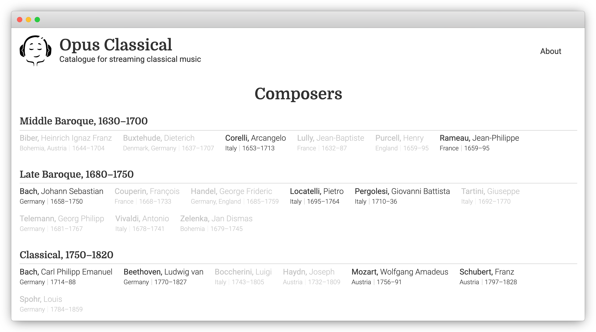

# Opus Classical


Curated catalogue of classical music with quick links to streaming services.

[API Docs](Docs/api.md)



- Select composer
- Select work
- Select recording
- Select streaming service
- Streaming service app opens
- Listen right away

Tidal and Spotify supported.

Works on desktop and mobile. Fast links to streaming apps tested on macOS, Linux, iOS.

Stack: F#, Saturn, .NET 5, Postgres, Dapper, SASS, Docker.

F# is ❤️.

## Build and run

### Requirements

- Have PostgreSQL 13 installed and available.
- Have Redis 6 installed and available.
- Restore Postgres database from a dump in `Migrations` folder.
- Prepare environment variables:

```
Sentry:Dsn=https://path.sentry.io
ASPNETCORE_URLS=http://+:5000
DbConnectionString=Host=host.docker.internal;Username=your-user;Database=composers;Minimum Pool Size=10
StaticAssetsUrl=https://static.zunh.dev/composers/covers/
RedisConnectionString=redis:6379
```

- `Sentry` is URL for reporting events and exceptions to Sentry.io
- `ASPNETCORE_URLS` is the local URL for the web app
- `DbConnectionString` is Postgres connection string
- `StaticAssetsUrl` is the path to static images storage
- `RedisConnectionString` is Redis connection string

### Using Docker

- Have `composers.env` file with the following content, set appropriate values for your configuration:
- Have Docker installed, including Docker compose.
- Run with 

```
$ docker-compose up -d
```

### Without Docker

- Have Node.js 14 installed.
- Have SASS compiler installed.
- Compile static assets:

```
$ cd Site
$ npm run i
$ npm run sass
$ npm run build
```

- Have `composers.env` file the environment variables described above.
- Build solution:

```
$ dotnet build
```

- Have environment variables available in the shell.
- Run the Site project:

```
$ cd Site
$ dotnet run
```